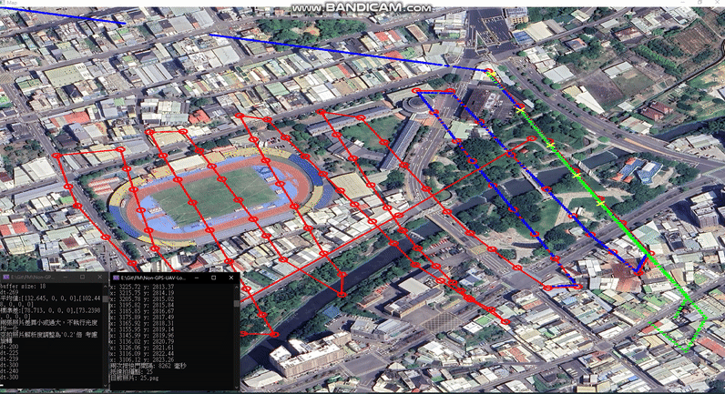

# GPS-Denied-Localization-for-UAVs-with-Feature-Matching
This repository implements a GPS-denied UAV localization algorithm based on KAZE feature matching and image correction, designed as a Software-In-the-Loop (SIL) simulation platform. The system enables UAVs to localize themselves using aerial imagery and onboard sensors (IMU/INS) without relying on GPS signals.

## Overview
To closely simulate the communication between real UAV hardware and the localization algorithm, this platform uses multi-threading and socket-based data exchange to emulate real-time data flow between the UAV (sensor data publisher) and the perception algorithm (localization estimator). This design helps verify algorithm performance under realistic communication conditions and system constraints.

 


## Project Structure
```
├── ImgLocatingAL/           // Main algorithms folder
    └── Header.h             // Define algorithms.
    └── ImgAL_socket.h       // Define socket function and data structure.
    └── ImgLocatingAL.cpp    // Implement algortihms
    └── ImgAL_socket.cpp     // Data exchange
    └── ImgLocatingAL.sln    // sln File
    
├── UAV_model/               // Simulate UAV dynamics and sensor feedback
    └── UAV_model.h
    └── UAV_model.cpp
```

## Installation
This project was developed and tested using **Visual Studio 2022**.  
For best compatibility and easiest setup, we recommend opening the provided `.sln` file directly:

1. Install OpenCV [https://opencv.org/releases/]
2. Install [Visual Studio 2019+]
3. Open the file `ImgLocatingAL.sln`
4. Run with `Ctrl + F5`
